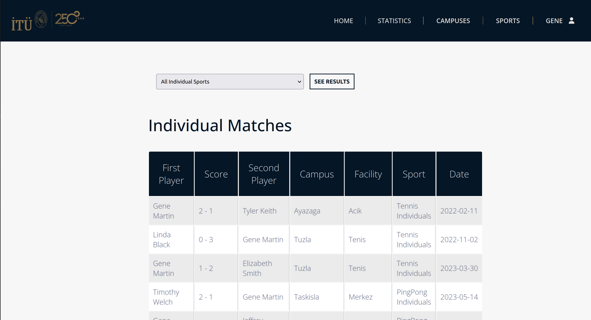

# ITU Sports Facility Reservation System

## Overview
This project is a web-based reservation system for Istanbul Technical University's (ITU) sports facilities. It was developed as a term project for the Database Systems course by students of ITU's Artificial Intelligence & Data Engineering department. The system simulates a real-world reservation platform, focusing on database management, user experience, and web development.

## Features
- User registration and login
- View and filter ITU campuses and sports facilities
- Make reservations for individual and team sports
- Create and manage teams
- View match history and statistics
- Edit user profiles
- User-friendly interface with ITU-themed design

## Technologies Used
- **Backend:** Python, Flask
- **Frontend:** HTML, CSS, JavaScript
- **Database:** MySQL (local, with synthetic data)
- **Other:** NumPy, Faker (for data generation)

## Database Structure
The system uses a relational database with 11 tables, including:
- `user`, `campus`, `sport`, `facility`, `team`
- Relationship and history tables: `facility_for_sport`, `team_match_history`, `individuals_match_history`, `reservation_individual`, `reservation_individual_match`, `reservation_team`

The database is managed via SQL scripts and Python scripts for synthetic data generation. See `database/commands/SCHEMA.sql` for details.

## System Architecture
- Flask routes connect URLs to Python functions, rendering HTML templates with dynamic data from the database.
- The frontend uses a navigation bar for easy access to all main sections: Home, Statistics, Campuses, Sports, Profile.
- Most pages are dynamically rendered based on database content.

## Screenshots
Below are some screenshots of the application interface:

### Main Page


### Login Page


### Register Page


### Navigation Bar


### Statistics Page


### Campuses


### Sports


### User Profile


### Update Profile


### Team Profile


### Create Team


### Previous Matches


### Reservation Page


## How to Run
1. Clone the repository.
2. Set up a local MySQL database and update the configuration in `MyFlaskApp/config.yaml`.
3. Run the SQL scripts in `database/commands/` to create tables and insert sample data.
4. Install Python dependencies (see `lib.txt`).
5. Start the Flask app from the `MyFlaskApp` directory:
   ```bash
   python app.py
   ```
6. Open your browser and go to `http://localhost:5000`.

## Team Members & Contributions
- **Abdullah Bilici:** Data generation, database integration, user/team profile backend, match history, ranking pages
- **Bora Boyacıoğlu:** Database creation, website fundamentals, visual design
- **Eren Oluğ:** Database scripts, team creation, user profile frontend
- **Öykü Eren:** Web app backend, login/registration, campus and sports pages
- **Salim Beyden:** Synthetic data generation, reservation backend

## License
This project is for educational purposes.

